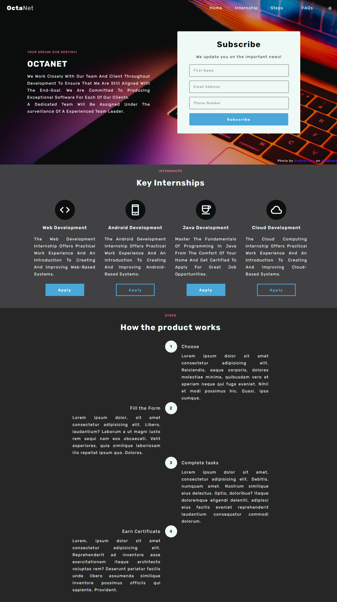
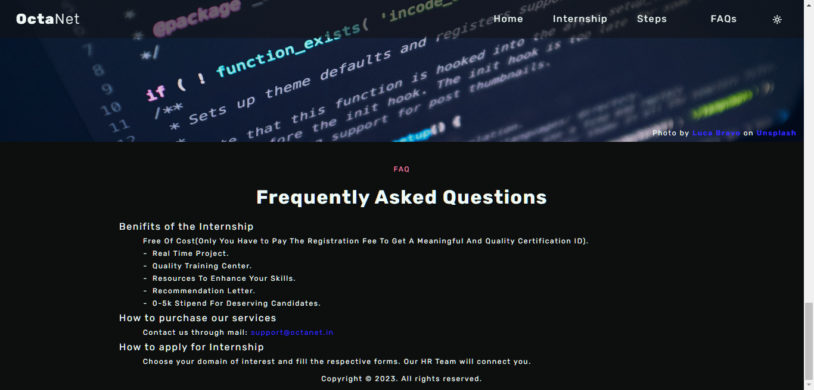
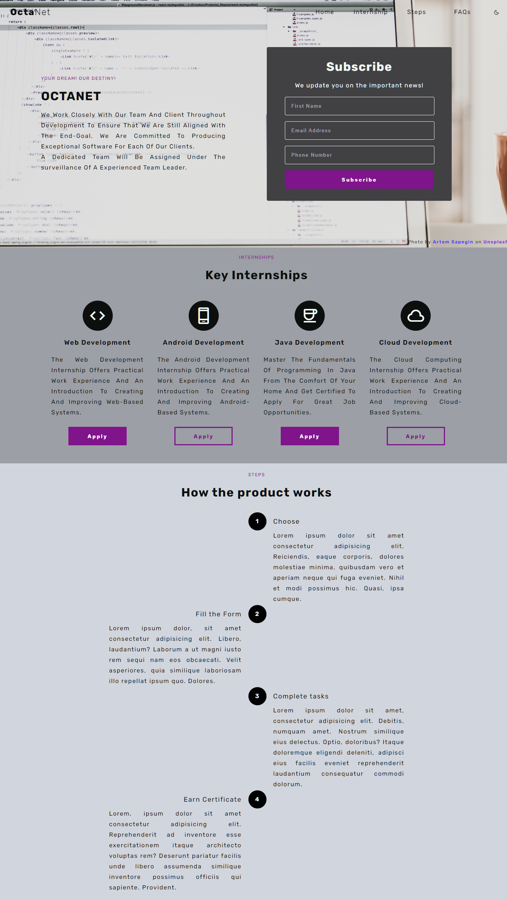
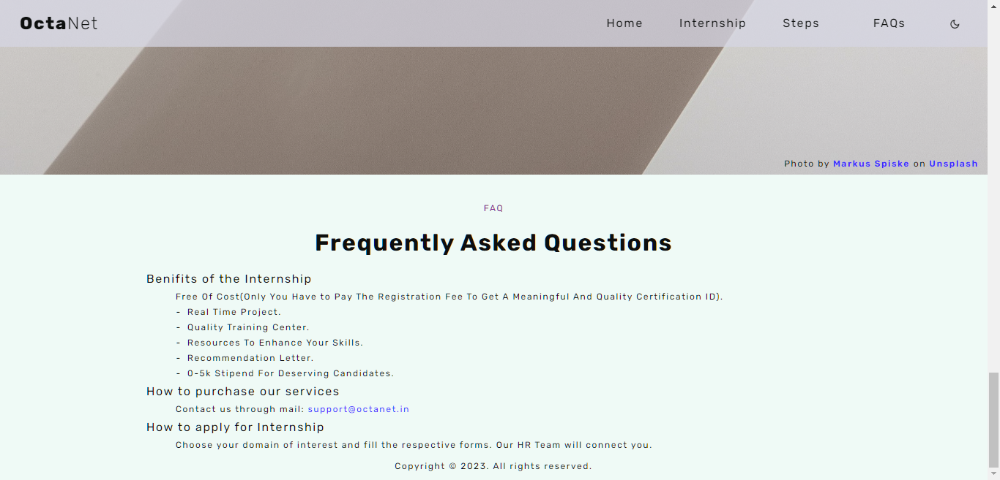

# Landing-Page

This project uses HTML, CSS, and JavaScript.  
It features a dark - light theme button and  a sticky navigation bar.

## Using this Repo

Fork this repository. Go to the forked repo and clone it into your local device.  
Open the `landing-page.html` on your preferred Web Browser.  
Viola! You can preview the landing page.

## Final Output

